- title : Playing with Bayer, Floyd and Steinberg
- description : F# by example: Playing with Bayer, Floyd and Steinberg
- author : Milosz Krajewski (milosz.krajewski@gmail.com)
- theme : beige
- transition : default

***

# F# by example
## Playing with Bayer, Floyd and Steinberg...

## ...and Knuth

---

https://github.com/MiloszKrajewski/dotnetcambridge-dither

***

### About me

- Milosz Krajewski
- BLOBAs @ Sepura
- first line of code written in ~1984
- C, C++, C#, SQL
- (Iron)Python, F#

---

### Background

- Algorithms
- Data Structures
- Algorithm Complexity
- Graph Theory
- Design Patterns

---

### Most recently

- Parallel
- Distributed
- Reactive
- Functional

***

> A physicist and a mathematician setting in a faculty lounge. Suddenly, the coffee machine catches on fire. The physicist grabs a bucket and leaps towards the sink, fills the bucket with water and puts out the fire. The second day, the same two sit in the same lounge. Again, the coffee machine catches on fire. This time, the mathematician stands up, gets a bucket, hands the bucket to the physicist, thus reducing the problem to a previously solved one.

---

> All generalizations are false, including this one. -- **Mark Twain**

---

> It is not about what is possible, it is about what is natural.

(**Note**: they are all Turing complete anyway)

***

### Agenda

- explain basic concepts about F#
- solve non-trivial problem using F#
- use idiomatic F#
- prove Donald Knuth wrong (kind of)
- use non-idiomatic F# when beneficial

---

### Not on agenda

- Discriminated unions
- Active patterns
- Async
- Monads

***

Once upon the time we were doing this:

    [lang=cs]
    public List<Person> ParseCsvFile(string fileName)
    {
        var result = new List<Person>();
        var reader = new StreamReader(fileName);
        while (true)
        {
            var line = reader.ReadLine();
            if (line == null)
                break;
            var person = ParseCsvLine(line);
            result.Add(person);
        }
        
        return person;
    }
    
(actually, there was no type inference)

---

But now we do it more like this:

    [lang=cs]
    public static IEnumerable<string> EnumerateLines(this TextReader reader)
    {
        string line;
        while ((line = reader.ReadLine()) != null)
            yield return line;
    }
    
    public IEnumerable<Person> ParseCsvFile(string fileName)
    {
        return 
            new StreamReader(fileName)
            .EnumerateLines()
            .Select(l => ParseCsvLine(l));
    }

---

Just because it is much easier to make it parallel:

    [lang=cs]
    public IEnumerable<Person> ParseCsvFile(string fileName)
    {
        return 
            new StreamReader(fileName)
            .EnumerateLines()
            .AsParallel()
            .Select(l => ParseCsvLine(l));
    }

---

or even more parallel:

    [lang=cs]
    public IEnumerable<Person> ParseCsvFiles(IEnumerable<string> fileNames)
    {
        return 
            fileNames
            .AsParallel()
            .SelectMany(fn => ParseCsvFile(fn));
    }
    
***

If you like those features in C#:

- Generics
- Nullables
- Iterators (`yield`)
- Implicit types and type inference (`var` and `Tuple.Create`)
- Lambda functions
- Asynchronous (`async` and `await`)
- Linq / extension methods

F# is for you.

***

### F# is about (for me)

- Low ceremony, low noise
- Visually honest
- Strongly typed, type inference, automatic generalization
- Expression orientated
- Pattern matching
- Functional
- Immutable by default
- Inherently SOLID (but I will skip this one)

***

#### Low ceremony, low noise

`PersonDTO` in C#

    [lang=cs]
    public class PersonDTO
    {
        private readonly Guid _id = Guid.NewGuid();
        private readonly string _name;
        private readonly int _age;
        
        public Guid Id { get { return _id; } }
        public string Name { get { return _name; } }
        public int Age { get { return _age; } }
        
        public PersonDTO(string name, int age)
        {
            if (ReferenceEquals(name, null)) 
                throw new ArgumentNullException("name");
            _name = name;
            _age = age;
        }
        
        public override ToString()
        {
            return string.Format("PersonDTO(Name: \"{0}\", Age: {1})", _name, _age);
        }
    }

(...not over yet...)

---

    [lang=cs]
    public class PersonDTO
    {
        public override Equal(object obj)
        {
            if (ReferenceEquals(obj, this)) 
                return true;
            var other = obj as PersonDTO;
            if (ReferenceEquals(other, null)) 
                return false;
            return Name == other.Name && Age == other.Age;
        }
        
        public override int GetHashCode()
        {
            return Name.GetHashCode() * 7 + Age.GetHashCode();
        }
    }

---

while in F# it would be:

    [lang=fs]
    open System

    type PersonDTO(name, age) =
        let id = Guid.NewGuid()
        member x.Id = id
        member x.Name = name
        member x.Age = age
        override x.ToString() = 
            sprintf "Person(Name: \"%s\", Age: %d)" name age

(**Note**: types? anyone for a bet?)

---

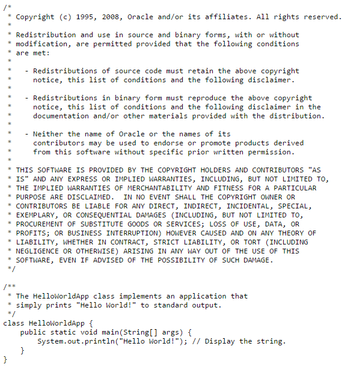

---

Venkat Subramaniam - Scala for the Intrigued @ 35min

https://www.youtube.com/watch?v=grvvKURwGNg

***

#### Visual honesty

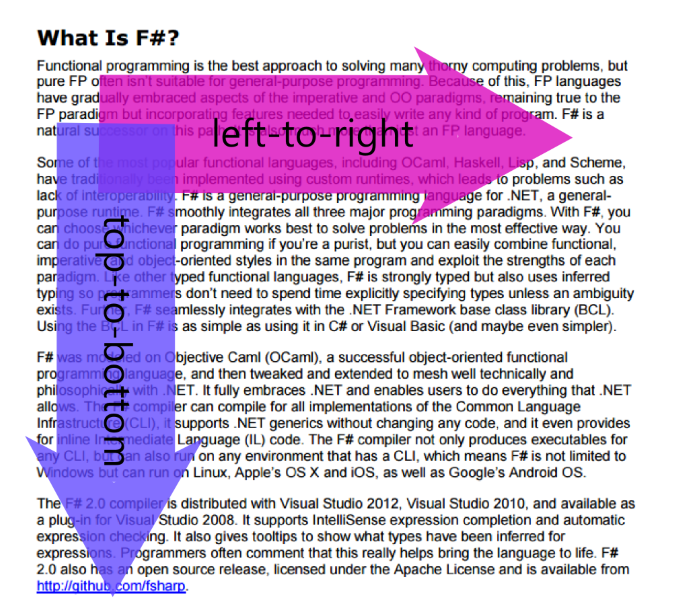

---

C# is generally left-to-right and top-down, but has islands of right-to-left'isms and bottom-up'isms:
    
    [lang=cs]
    SendEmail(
        GenerateEmailFromTemplate(
            "YouHaveBeenSelectedTemplate",
                GetPersonsEmailAddress( 
                    FindPersonById(id))));
                    
---

F# helps to sort this out using `|>` operator:

    [lang=fs]
    id 
    |> findPersonById
    |> getPersonsEmailAddress
    |> generateEmailFromTemplate "YouHaveBeenSelectedTemplate"
    |> sendEmail

although, it is binary identical to:

    [lang=fs]
    sendEmail (
        generateEmailFromTemplate "YouHaveBeenSelectedTemplate" (
            getPersonsEmailAddress (
                findPersonById id)))

---

What would this code print?

    [lang=fs]
    let mutable (x, y) = 0, 1
    for i = 1 to 8 do
       x <- x + 1
       y <- y * 2
    printfn "%d,%d" x y

---

And this one?

    [lang=cs]
    int x = 0, y = 1;
    for (var i = 1; i <= 8; ++i)
       x = x + 1;
       y = y * 2;
    Console.WriteLine("{0},{1}", x, y);

---

Kevlin Henney - Seven Ineffective Coding Habits of Many Programmers

https://vimeo.com/97329157

***

#### Strongly typed with type inference (and automatic generalization)

    [lang=fs]
    let func1 a b f = a, b
    let func2 a b f = f a, b
    let func3 a b f = f a, f b
    let func4 a b f = f (a + " ?"), f (b + " !")
    let func5 a b f = f (a + " ?") + 1, f (b + " !")

---

It's like `var` but everywhere:

    [lang=fs]
    open System

    /// retries given action; 
    /// returns its result or throws exception
    /// after `countLimit` failures or when `timeLimit` expires
    let retry countLimit timeLimit func arg =
        let timeLimit = DateTime.Now.Add(TimeSpan.FromSeconds(timeLimit))
        let rec retry count =
            try 
                func arg 
            with 
            | _ when (count <= countLimit && DateTime.Now <= timeLimit) -> 
                retry (count + 1)
            | _ -> 
                failwith "Operation failed"
        retry 0

(**Note**: copy-paste, and inspect types of things, remove `FromSeconds(...)`)

***

#### Expression orientated

in C# `switch` is a statement not an expression, it doesn't have result, it just does things:

    [lang=cs]
    string text; // know your type
    switch (digit)
    {
        case 0: text = "zero"; // do-assign
        case 1: text = "one";
        // ...
        case 9: text = "nine";
    }

---

Sometime you just wish for:

    [lang=cs]
    var text = switch (digit) {
        case 0: "zero"; // evaluate-and-return
        case 1: "one";
        // ...
        case 9: "nine";
    };

---

In F# `match` is an expression

    [lang=fs]
    let text =
        match digit with
        | 0 -> "zero"
        | 1 -> "one"
        // ...
        | 9 -> "nine"

---

...as well as `try`/`catch`:

    [lang=fs]
    let text = Console.ReadLine()
    let value = try Int32.Parse(text) with | _ -> 0
    printfn "%d" value

---

in C# it gets messy when variable is of some complex type:

    [lang=cs]
    IEnumerable<IGrouping<int, Tuple<string, IEnumerable<double>>> result;

    try
    {
        result = SomeFunctionReturningComplexType();
    }
    catch (Exception e)
    {
        result = AlternativeAccessToResult();
    }

    DoSomethingWith(result);

---

`var` is not an option as it would limit the scope:

    [lang=cs]
    try
    {
        var result = SomeFunctionReturningComplexType();
    }
    catch (Exception e)
    {
        var result = AlternativeAccessToResult();
        // ???
    }

    // "result" is not available here...

---

Generators (`IEnumerable`) are also expressions (not functions):

    [lang=fs]
    let powers = seq { for i = 0 to 31 do yield 1u <<< i }
    for p in powers do
        printfn "%d" p

***

#### Pattern matching

`match` expression

    [lang=fs]
    let func4 array =
        match array with
        | [| x; 0; 0 |] -> printfn "Yup, %d and two zeroes" x
        | [| _; 2; _ |] -> printfn "2 in the middle"
        | [| _; _; _ |] -> printfn "3 random elements"
        | _ -> printfn "I wanted 3 elements, not %d" array.Length

    func4 [| 3; 0; 0 |] // Yup, 3 and two zeroes
    func4 [| 4; 2; 2 |] // 2 in the middle
    func4 [| 6; 1; 7 |] // 3 random elements
    func4 [| 1 |] // I wanted 3 elements, not 1

---

The `EnumerateLines` method we used before:

    [lang=cs]
    public static IEnumerable<string> EnumerateLines(this TextReader reader)
    {
        string line;
        while ((line = reader.ReadLine()) != null)
            yield return line;
    }

had two sub-optimal solutions:

- up-front declaration of `line`
- naughty assigment in the middle of condition

---

Just because of `match` syntax we don't need to do any of those:

    [lang=fs]
    let rec enumerateLines (reader: TextReader) =
        seq {
            match reader.ReadLine() with
            | null -> ()
            | line -> yield line; yield! enumerateLines reader
        }

(with type extender, if you like)

    [lang=fs]
    type TextReader with member reader.EnumerateLines() = reader |> enumerateLines

---

`tuple` unpacking

    [lang=fs]
    let func1 p =
        let x, y = p
        printfn "as tuple: %A, as x and y: %A, %A" p x y

    let func2 ((x, y) as p) =
        printfn "as tuple: %A, as x and y: %A, %A" p x y

    let func3 ((x, _) as p) =
        let (_, y) = p
        printfn "as tuple: %A, as x and y: %A, %A" p x y

     // as tuple: (1234, 3455), as x and y: 1234, 3455
    func1 (1234, 3455)
    func2 (1234, 3455)
    func3 (1234, 3455)

---

Bait-and-switch / is-as:

    [lang=fs]
    open System.Text

    let func5 (subject: obj) =
        match subject with
        | :? StringBuilder as sb -> sb.Append(" was a StringBuilder").ToString()
        | :? string as s -> s + " is a string"
        | _ -> invalidArg "subject" "No idea what to do"

    // StringBuilder was a StringBuilder
    func5 (StringBuilder().Append("StringBuilder")) |> printfn "%s"

    // string is a string
    func5 ("string") |> printfn "%s"

---

C# alternative (`is` and `as`)

    [lang=cs]
    static string Func5(object subject)
    {
        if (subject is StringBuilder)
        {
            var sb = subject as StringBuilder;
            return sb.Append(" was a StringBuilder").ToString();
        }
        else if (subject is string)
        {
            var s = subject as string;
            return s + " is a string";
        }
        else
        {
            throw new ArgumentException("No idea what to do", "subject");
        }
    }
    
**Problem**: double cast

---

C# alternative (`as` and `null`)

    [lang=cs]
    static string Func5(object subject)
    {
        var sb = subject as StringBuilder;
        var s = subject is string;

        if (sb != null)
        {
            return sb.Append(" was a StringBuilder").ToString();
        }
        else if (s != null)
        {
            return s + " is a string";
        }
        else
        {
            throw new ArgumentException("No idea what to do", "subject");
        }
    }
    
**Problem**: wrong scope (too wide) and premature evaluation

---

C# alternative (`as` and `null`)

    [lang=cs]
    static string Func5(object subject)
    {
        var sb = subject as StringBuilder;

        if (sb != null)
        {
            return sb.Append(" was a StringBuilder").ToString();
        }
        else
        {
            var s = subject is string;
            
            if (s != null)
            {
                return s + " is a string";
            }
            else
            {
                throw new ArgumentException("No idea what to do", "subject");
            }
        }
    }
    
**Problem**: else induced pyramid of doom

***

#### Functional

The answer to lot of questions is: **function**

---

All functions have one argument and one result.

---

You would think that you have:

    [lang=cs]
    Action action;
    Func<T> factory;
    Func<T, U> converter;
    Func<T, U, V> combinator;

while in fact there is only one type:

    [lang=cs]
    Func<T, U> func;

or:
    
    [lang=fs]
    func: 'a -> 'b

---

C#

    [lang=cs]
    Action action; // Func<void, void>

F#

    [lang=fs]
    action: unit -> unit

---

C#

    [lang=cs]
    Action<string> action; // Func<string, void>

F#

    [lang=fs]
    action: string -> unit

---

C#

    [lang=cs]
    Func<string> func; // Func<void, string>

F#

    [lang=fs]
    func: unit -> string

---

C#

    [lang=cs]
    Func<double, string> func;

F#

    [lang=fs]
    func: float -> string

---

C#

    [lang=cs]
    Func<double, int, byte[], string> func;

F#

    [lang=fs]
    func: (float * int * byte[]) -> string

---

F#

    [lang=fs]
    func: float -> int -> byte[] -> string

is actually:

    [lang=fs]
    func: float -> (int -> (byte[] -> string))

you can model it in C# but you rarely see it:

    [lang=cs]
    Func<float, Func<int, Func<byte[], string>>> func;

---

Currying / partial application

    [lang=fs]
    let sendEmailsToAll (personLoader: int -> Person) =
        for id in getAllPersonIds () do
            let person = personLoader id
            sendEmailTo person

    let loadPerson (connection: SqlConnection) (id: int) =
        // ... do stuff ...

    sendEmailsToAll (loadPerson connection)

***

#### Immutable by default

How I can get anything done without mutability?

---

Once upon the time...

    [lang=basic]
    10 PRINT "THIS IS PROGRAM IN BASIC"
    20 LET P = 3.1415927
    30 LET E = 2.7172
    50 LET X = E * P
    60 IF X > 6 THEN PRINT "X is greater than 6"
    70 FOR I = 1 TO 100 DO PRINT "I is " + I
    80 LET X = X + 1
    ...

---

Let's consider a program to calculate a sum of given numbers:

    [lang=cs]
    public static double Sum(double[] values)
    {
        var sumSoFar = 0.0;
        for (var index = 0; index < values.Length; index++)
            sumSoFar += values[index];
        return sumSoFar;
    }

    public static void Main()
    {
        Console.WriteLine("{0}", Sum(new[] { 1.0, 2.0, 3.0, 4.0 }));
    }

---

In F# you don't mutate result:

    [lang=fs]
    let sum values =
       let rec partial sumSoFar list =
           match list with
           | [] -> sumSoFar
           | head :: tail -> partial (head + sumSoFar) tail
       partial 0.0 values

    printfn "%g" (sum [ 1.0; 2.0; 3.0; 4.0 ])

you produce new result and pass it forward

***

### Idiomatic?

> **idiomatic**: using, containing, or denoting expressions that are natural to a native speaker.

---

### Idiomatic F#?

- Separation of data and behaviour
- Functions all the way down
- No abstraction is too small
- Map/reduce (zip/fold/iter/...)

***

### map

    [lang=fs]
    X.map: (f: 'T -> 'U) -> (x: X<'T>) -> X<'U>

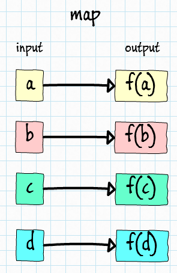

---

in C# known as `Select`, for example:

    [lang=fs]
    ["image1.jpg"; "image2.jpg"]
    |> Seq.map Image.FromFile

is equivalent to:

    [lang=cs]
    new { "image1.jpg", "image2.jpg" }
        .Select(fn => Image.FromFile(fn))

***

### reduce

    [lang=fs]
    X.reduce (f: 'T -> 'T -> 'T) -> (x: X<'T>) -> 'T

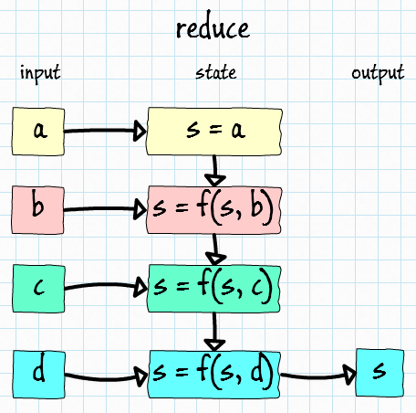

---

#### sum (or concat)

    [lang=fs]
    values |> Seq.reduce (+)
    values |> Seq.reduce (fun x y -> x + y)

---

#### factorial n

    [lang=fs]
    // { 2..n } = seq { for i = 2 to n do yield i }
    { 2..n } |> Seq.reduce (*)
    { 2..n } |> Seq.reduce (fun x y -> x * y)

---

#### min

    [lang=fs]
    values |> Seq.reduce min
    values |> Seq.reduce (fun a b -> min a b)
    values |> Seq.reduce (fun a b -> if a <= b then a else b)

---

#### count

    [lang=fs]
    values |> Seq.map (fun _ -> 1) |> Seq.reduce (+)

---

#### first

    [lang=fs]
    values |> Seq.reduce (fun a b -> a)

---

#### last

    [lang=fs]
    values |> Seq.reduce (fun a b -> b)

***

### fold

    [lang=fs]
    X.fold (f: 'S -> 'T -> 'S) -> (s: 'S) -> (x: X<'T>) -> 'S

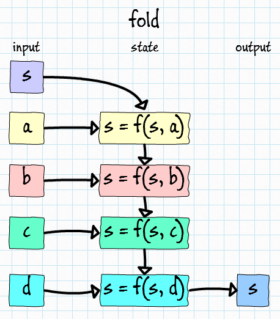

---

`fold` is like `reduce` (or `reduce` is-a `fold`) but allows to separate input type from output type:

    [lang=fs]
    let reduce =
        [1; 2; 3; 4; 5]
        |> Seq.reduce (fun a b -> a + b)

    let fold1 =
        [1; 2; 3; 4; 5]
        |> Seq.fold (fun a b -> a + b) 0

    let fold2 =
        [1; 2; 3; 4; 5]
        |> Seq.fold (fun s n -> s + string n) ""

    // reduce: 15, fold1: 15, fold2: "12345"
    printfn "reduce: %A, fold1: %A, fold2: %A" reduce fold1 fold2

***

### iter

    [lang=fs]
    X.iter (f: 'T -> unit) -> (x: X<'T>) -> unit
    

---

    [lang=fs]
    let countDown () = 
        { 10..-1..0 }
        |> Seq.iter (printfn "%d")
        
    // 10... 9... 8... 1... 0
    countDown ()

***

### filter

    [lang=fs]
    X.filter (f: 'T -> bool) -> (x: X<'T>) -> X<'T>
    
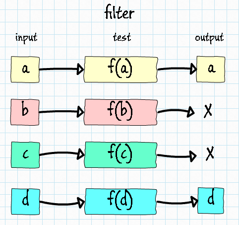

---

    [lang=fs]
    let allNumbers = [ 1..10 ]
    let evenNumbers = 
        allNumbers 
        |> List.filter (fun n -> n % 2 = 0)

    // all: [1; 2; 3; 4; 5; 6; 7; 8; 9; 10], even: [2; 4; 6; 8; 10]
    printfn "all: %A, even: %A" allNumbers evenNumbers

***

### scan

    [lang=fs]
    X.scan (f: 'S -> 'T -> 'S) -> (s: 'S) -> (x: X<'T>) -> X<'S>

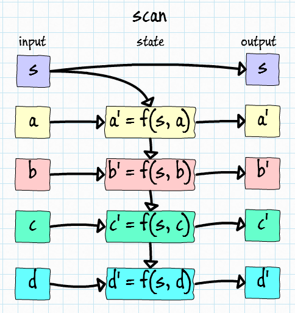

---

Like `fold` as it has state, but also yields state on every item:

    [lang=fs]
    let fold =
        [1; 2; 3; 4; 5]
        |> List.fold (fun s n -> s + string n) ""

    let scan =
        [1; 2; 3; 4; 5]
        |> List.scan (fun s n -> s + string n) ""

    // fold: "12345", scan: [""; "1"; "12"; "123"; "1234"; "12345"]
    printfn "fold: %A, scan: %A" fold scan

(btw, `map` is-a `scan`)

***

### Your first zip/scan

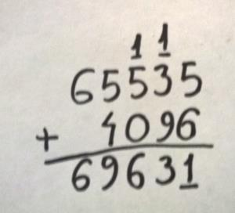

- zip sequences (create digit pairs)
- start with carry = 0
- add digits in pairs (plus carry)
- emit sum % 10
- carry sum / 10

***

### unfold

    [lang=fs]
    X.unfold (f: 'S -> ('T * 'S) option) -> 'S -> X<'T>

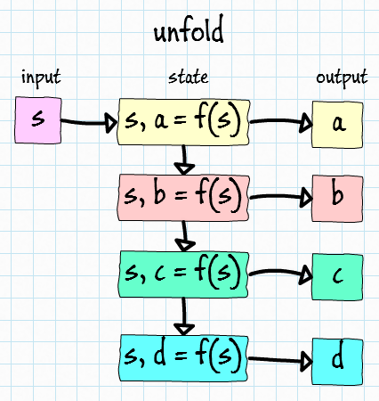

---

    [lang=fs]
    let countDown =
        10
        |> Seq.unfold (fun s -> if s < 0 then None else Some (string s, s - 1))
        |> Seq.toList

    // unfold: ["10"; "9"; "8"; "7"; "6"; "5"; "4"; "3"; "2"; "1"; "0"]
    printfn "unfold: %A" countDown

***

### Everything is unfold/filter/map/fold

    [lang=fs]
    let csvToXml fileName =
        fileName
        |> openStream
        |> Seq.unfold readLine
        |> Seq.map tryParsePerson
        |> Seq.filter isValidPerson
        |> Seq.fold addToXml (XmlDocument())

(**Note**: actually, everything is `.SelectMany(...)`, `flatMap` and `collect`)

[Bart De Smet: MinLINQ](http://channel9.msdn.com/Shows/Going+Deep/Bart-De-Smet-MinLINQ-The-Essence-of-LINQ)

***

### UI

---

`ViewerForm` with `PictureBox` on it:

    [lang=fs]
    module UI =
        open System.Drawing
        open System.Threading
        open System.Windows.Forms

        type ViewerForm() as form =
            inherit Form(TopMost = true)

            let viewer = 
                new PictureBox(
                    Dock = DockStyle.Fill, 
                    SizeMode = PictureBoxSizeMode.Zoom)

            do form.Controls.Add(viewer)

---

...with ability to `LoadImage` and `NextImage` event:

    [lang=fs]
    module UI =
        type ViewerForm() as form =
            member form.LoadImage (title, image) = 
                form.Text <- title
                viewer.Image <- image
                form.AdjustSize image.Size

            member form.NextImage =
                form.KeyPress
                |> Event.filter (fun e -> e.KeyChar = ' ')
                |> Event.map (fun _ -> form)

---

...one of longest methods here, adjusts form size to fit image:

    [lang=fs]
    module UI =
        type ViewerForm() as form =
            member private form.AdjustSize clientSize =
                let inline sizeDiff (a: Size) (b: Size) = 
                    Size(a.Width - b.Width, a.Height - b.Height)
                let inline sizeRatios (a: Size) (b: Size) =
                    float a.Width / float b.Width, float a.Height / float b.Height

                let screenRect = Screen.FromControl(form).WorkingArea
                let formMargin = sizeDiff form.Size form.ClientSize
                let maximumClientSize = sizeDiff screenRect.Size formMargin
                let ratioX, ratioY = sizeRatios maximumClientSize clientSize
                let ratio = min ratioX ratioY
                let clientX = float clientSize.Width * ratio |> round |> int
                let clientY = float clientSize.Height * ratio |> round |> int
                let originX = (screenRect.Right - clientX - formMargin.Width) / 2
                let originY = (screenRect.Bottom - clientY - formMargin.Height) / 2

                form.SetBounds(
                    originX, originY, 
                    clientX + formMargin.Width, clientY + formMargin.Height)

---

Showing form in console application is a little bit different than in F# interactive (or WinForms application):

    [lang=fs]
    module UI =
        #if CONSOLE
        let private showForm factory = 
            let action () = Application.Run(factory () :> Form)
            Thread(action, IsBackground = true).Start()
        #else
        let private showForm factory = (factory () :> Form).Show()
        #endif

        let private showViewer setup =
            let factory () = let form = new ViewerForm() in setup form; form
            showForm factory

(**Note**: no abstraction is too small)

---

My own solution to functions returning `unit` or 'ignorable' results is `apply-in-passing` operator:

    [lang=fs]
    [<AutoOpen>]
    module Operators =
        let inline apply func arg = func arg |> ignore; arg

which allows more 'flow':

    [lang=fs]
    module UI =
        let private showViewer setup =
            // let factory () = let form = new ViewerForm() in setup form; form
            let factory () = new ViewerForm() |> apply setup
            showForm factory

(**Note**: Select, ForEach, Array.Sort)

---

But the interface of UI module are actually these two methods: `showOne` and `showMany`:

    [lang=fs]
    module UI =
        let showOne title image =
            showViewer (fun form ->
                form.NextImage |> Event.add (fun _ -> form.Close())
                form.LoadImage(title, image)
            )

        let showMany (images: (string * #Image) seq) =
            let images = images.GetEnumerator()
            showViewer (fun form ->
                let nextImage () = 
                    match images.MoveNext() with
                    | true -> images.Current |> form.LoadImage
                    | _ -> form.Close()
                form.NextImage |> Event.add (fun _ -> nextImage ())
                nextImage ()
            )

(**Note**: images.Current |> form.LoadImage)

***

### Bitmap

***

To ceorce loaded bitmaps into right format:

    [lang=fs]
    open System.Drawing
    open System.Drawing.Imaging
    open System.Runtime.InteropServices

    module Bitmap =
        let bitmapFormat = PixelFormat.Format32bppRgb

        let private enforceFormat (image: Image) =
            match image with
            | :? Bitmap as bitmap when bitmap.PixelFormat = bitmapFormat ->
                bitmap
            | _ ->
                let width, height = image.Width, image.Height
                let bitmap = new Bitmap(width, height, bitmapFormat)
                use graphics = Graphics.FromImage(bitmap)
                graphics.DrawImage(image, 0, 0, width, height)
                bitmap

(**Note**: bait-and-switch)

---

In F# interactive current folder is in Temp folder; we don't want to play with paths in out session, so let's introduce fixPath function:

    [lang=fs]
    module Debug =
        #if INTERACTIVE
        let private fixPath path = System.IO.Path.Combine(__SOURCE_DIRECTORY__, path)
        #else
        let inline private fixPath path = path
        #endif

...allowing `Bitmap.load` to work seamlessly both in project and interactive session:

    [lang=fs]
    module Bitmap =
        let load (fileName: string) = 
            fileName |> Debug.fixPath |> Image.FromFile |> enforceFormat

---

...and at this point we can show some pictures:

    [lang=fs]
    #load "init.fsx"
    open FsDither

    "lena.jpg" |> Bitmap.load |> UI.showOne "lena"

    ["lena.jpg"; "david.jpg"] 
    |> Seq.iter (fun fn -> fn |> Bitmap.load |> UI.showOne fn)

    ["lena.jpg"; "david.jpg"] 
    |> Seq.map (fun fn -> (fn, fn |> Bitmap.load)) 
    |> UI.showMany

---

For performance reason, we won't be using `GetPixel` on Bitmap, we will be using raw bitmap data (and that's why we were coercing bitmap into known format):

    [lang=fs]
    module Bitmap =
        let lockBits (lockMode: ImageLockMode) (func: BitmapData -> 'a) (bitmap: Bitmap) =
            let width, height = bitmap.Width, bitmap.Height
            let rect = Rectangle(0, 0, width, height)
            let data = bitmap.LockBits(rect, lockMode, bitmapFormat)
            try
                func data
            finally
                bitmap.UnlockBits(data)

(**Note**: function-brackets, using, lock)

---

...so having raw bitmap data (`BitmapData`), we can read and write rows:

    [lang=fs]
    module Bitmap =
        let inline private physicalRowAddress line (data: BitmapData) = 
            data.Scan0 + nativeint (data.Stride * line)

        let getPhysicalPixels (data: BitmapData) row =
            assert (data.PixelFormat = bitmapFormat)
            let width = data.Width
            let buffer = Array.zeroCreate<int32> width
            let pointer = data |> physicalRowAddress row
            Marshal.Copy(pointer, buffer, 0, buffer.Length)
            buffer

        let setPhysicalPixels (data: BitmapData) row (vector: int32[]) =
            assert (data.PixelFormat = bitmapFormat)
            assert (data.Width = vector.Length)
            let pointer = data |> physicalRowAddress row
            Marshal.Copy(vector, 0, pointer, vector.Length)

(**Note**: Make illegal states unrepresentable)

---

### MISU (advanced)

    [lang=fs]
    module Bitmap =
        type Rgb32BitmapData = | Rgb32BitmapData of BitmapData

        let lockBits (lockMode: ImageLockMode) (func: Rgb32BitmapData -> 'a) (bitmap: Bitmap) =
            let width, height = bitmap.Width, bitmap.Height
            let rect = Rectangle(0, 0, width, height)
            let data = bitmap.LockBits(rect, lockMode, PixelFormat.Format32bppRgb)
            try
                func (Rgb32BitmapData data)
            finally
                bitmap.UnlockBits(data)

        let setPhysicalPixels (data: Rgb32BitmapData) row (vector: int32[]) =
            // no assert or exceptions thrown, compiler does the format checking
            match data with
            | Rgb32BitmapData bdata ->
                let pointer = bdata |> physicalRowAddress row
                Marshal.Copy(vector, 0, pointer, vector.Length)

***

### Hey, but what about dithering for a change?

***

### Dithering

> **Dither**: is an intentionally applied form of noise used to randomize quantization error, preventing large-scale patterns such as color banding in images.

(from [Wikipedia](http://en.wikipedia.org/wiki/Dither))

---

#### Original

---

#### Treshold

---

#### Random

---

#### Bayer

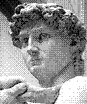

---

#### Floyd-Steinberg

***

### Value and Pixel

---

A `Value` representing color compound:

    [lang=fs]
    module Value =
        type Value = float

        let inline fromByte v = (v &&& 0xFF |> float) / 255.0
        let inline toByte v = (v |> min 1.0 |> max 0.0) * 255.0 |> round |> int
        
---

A bare `Pixel` struct:

    [lang=fs]
    module Pixel =
        open Value

        [<Struct>]
        type Pixel = 
            val r: Value
            val g: Value
            val b: Value
            new(r, g, b) = { r = r; g = g; b = b }

---

Conversion to and from `Int32`:

    [lang=fs]
    module Pixel =
        let inline fromInt32 physical =
            let inline toValue o v = v >>> o |> Value.fromByte
            Pixel(toValue 16 physical, toValue 8 physical, toValue 0 physical)

        let inline toInt32 (logical: Pixel) =
            let inline toByte o v = v |> Value.toByte <<< o
            (toByte 16 logical.r) ||| (toByte 8 logical.g) ||| (toByte 0 logical.b)

---

Conversion to and from grayscale and access to members as functions:

    [lang=fs]
    module Pixel =
        let inline getL (pixel: Pixel) = 0.2126*pixel.r + 0.7152*pixel.g + 0.0722*pixel.b
        let inline fromL (l: Value) = Pixel(l, l, l)

        let inline getR (pixel: Pixel) = pixel.r
        let inline getG (pixel: Pixel) = pixel.g
        let inline getB (pixel: Pixel) = pixel.b

***

### Seq and Range

---

As we would like to do as much as possible in parallel 
let's preemptively add parallel-iter (`piter`) to `Seq` module...

    [lang=fs]
    module Seq =
        let inline piter func (s: 'a seq) = 
            Parallel.ForEach(s, Action<'a>(func)) |> ignore

---

...and define a `Range` module for pseudo-sequence `{lo..hi}` with `iter` and `fold`:

    [lang=fs]
    module Range =
        type Range = (int * int)

        let inline iter func (lo, hi) = 
            // { lo..hi } |> Seq.iter func
            for i = lo to hi do func i

        let inline piter func (lo, hi) =
            // { lo..hi } |> Seq.piter func
            Parallel.For(lo, hi + 1, Action<int>(func)) |> ignore

        let inline fold func state (lo, hi) =
            // { lo..hi } |> Seq.fold func state
            let mutable s = state
            for i = lo to hi do s <- func i s
            s

***

### Matrix

See **Math.NET Numerics** for better matrices

http://numerics.mathdotnet.com/

---

Let's define `Matrix` module for matrix operations...

    [lang=fs]
    module Matrix = // Array@d
        let inline zeroCreate height width = Array2D.zeroCreate height width
        let inline init height width func = Array2D.init height width func
        let inline map func matrix = Array2D.map func matrix
        let inline mapi func matrix = Array2D.mapi func matrix

        let inline widthOf matrix = Array2D.length2 matrix
        let inline heightOf matrix = Array2D.length1 matrix
        let inline sizeOf matrix = heightOf matrix, widthOf matrix

(**Note**: Array@d, length2)

---

...and some parallel versions of `init`, `map` and `mapi`...

    [lang=fs]
    module Matrix =
        let pinit height width func =
            let result = zeroCreate height width
            let inline initPixel y x = result.[y, x] <- func y x
            let inline initRow row = for x = 0 to width - 1 do initPixel row x
            (0, height - 1) |> Range.piter initRow
            result

        let pmap func matrix =
            let height, width = matrix |> sizeOf
            let inline processPixel y x = func matrix.[y, x]
            pinit height width processPixel

        let pmapi func matrix =
            let height, width = matrix |> sizeOf
            let inline processPixel y x = func y x matrix.[y, x]
            pinit height width processPixel

---

Before we do some benchmarking let's define `timeit` operator:

    [lang=fs]
    module Debug =
        open System.Diagnostics

        let timeit name func arg = 
            let timer = Stopwatch.StartNew()
            let result = func arg
            timer.Stop()
            printfn "%s: %gms" name timer.Elapsed.TotalMilliseconds
            result

        let inline timeit0 name func = timeit name func () |> ignore

---

Change laptop's power management profile :-)

---

...and now, we can do some benchmarks to justify parallel versions:

    [lang=fs]
    #load "init.fsx"
    open FsDither

    let blue = Pixel.Pixel(0.0, 0.0, 1.0)
    let using func = fun () -> func 4000 4000 (fun y x -> blue)

    Debug.timeit0 "init" (using Matrix.init)
    Debug.timeit0 "pinit" (using Matrix.pinit)

    // init: 246.565200ms
    // pinit: 88.467200ms

---

...let's add some friendly slicing...

    [lang=fs]
    module Matrix =
        let inline blitRowToVector (matrix: 'a[,]) row column (array: 'a[]) index length =
            let inline clone i = array.[index + i] <- matrix.[row, column + i] 
            for i = 0 to length - 1 do clone i

        let inline blitVectorToRow (vector: 'a[]) index (matrix: 'a[,]) row column length =
            let inline clone i = matrix.[row, column + i] <- vector.[index + i]
            for i = 0 to length - 1 do clone i

        let applyRow matrix row vector =
            let matrixWidth = matrix |> widthOf
            let vectorLength = vector |> Array.length
            let length = min matrixWidth vectorLength
            blitVectorToRow vector 0 matrix row 0 length

        let extractRow matrix row =
            let length = matrix |> widthOf
            let vector = Array.zeroCreate length
            blitRowToVector matrix row 0 vector 0 length
            vector

***

### Picture

---

Technically `Picture` is just `Pixel[,]`:

    [lang=fs]
    open System.Drawing
    open System.Drawing.Imaging

    module Picture = 
        open Value
        open Pixel

        type Picture = Pixel[,]

        let fromBitmap (bitmap: Bitmap) =
            let width, height = bitmap.Width, bitmap.Height
            let matrix = Matrix.zeroCreate height width

            let inline cloneRow data row = 
                Bitmap.getPhysicalPixels data row
                |> Array.map Pixel.fromInt32
                |> Matrix.applyRow matrix row

            bitmap |> Bitmap.lockBits ImageLockMode.ReadOnly (fun data ->
                (0, height - 1) |> Range.piter (cloneRow data))
            matrix

        let load fileName = 
            fileName |> Bitmap.load |> fromBitmap

---

Let's inspect the type of result:

    [lang=fs]
    #load "init.fsx"
    open FsDither

    let typeof x = x.GetType()
    "lena.jpg" |> Picture.load |> typeof |> printfn "%A"

    // FsDither.Pixel+Pixel[,]

---

To convert back to `Bitmap`:

    [lang=fs]
    module Picture = 
        let toBitmap picture =
            let height, width = picture |> Matrix.sizeOf
            let bitmap = new Bitmap(width, height, Bitmap.bitmapFormat)

            let inline cloneRow data row = 
                Matrix.extractRow picture row
                |> Array.map Pixel.toInt32
                |> Bitmap.setPhysicalPixels data row

            bitmap |> Bitmap.lockBits ImageLockMode.WriteOnly (fun data ->
                (0, height - 1) |> Range.piter (cloneRow data))
            bitmap

(**Note**: spot the spot for apply)

---

Let's check, if we can convert `Pixel[,]` to `Bitmap`:

    [lang=fs]
    #load "init.fsx"
    open FsDither

    let ratio v t = float v / float t
    let gradient h w y x = Pixel.Pixel(ratio y h, 0.0, ratio x w)
    Matrix.pinit 200 200 (gradient 200 200) |> Picture.toBitmap |> UI.showOne "gradient"

---

To avoid explicit calls to this conversion let's mirror `UI.showOne` and `UI.showMany`:

    [lang=fs]
    module Picture = 
        let showOne title picture = 
            picture |> toBitmap |> UI.showOne title

        let showMany pictures =
            pictures |> Seq.map (fun (t, p) -> t, p |> toBitmap) |> UI.showMany

***

### Treshold

---

We will need quantizer:

    [lang=fs]
    module Value =
        let quantize n = 
            let q = 1.0 / float (n - 1) 
            fun v -> round (v / q) * q |> max 0.0 |> min 1.0

---

We will be working mostly with grayscale images, so we need conversion:

    [lang=fs]
    module Picture =
        let toGrayscale picture = picture |> Matrix.pmap Pixel.getL
        let fromGrayscale layer = layer |> Matrix.pmap Pixel.fromL

---

So, 'Treshold' processor has almost no implementation at all:

    [lang=fs]
    module Treshold = 
        let processLayer quantize layer =
            layer |> Matrix.pmap quantize

(**Note**: we can use `pmap`)

---

So, let's see:

    [lang=fs]
    #load "init.fsx"
    open FsDither

    "flowers-large.jpg"
    |> Picture.load 
    |> Picture.toGrayscale 
    |> Treshold.processLayer (Value.quantize 2) 
    |> Picture.fromGrayscale 
    |> Picture.showOne "treshold"

---

...or maybe a little bit more fancy:

    [lang=fs]
    #load "init.fsx"
    open FsDither

    seq {
        let color = "flowers-large.jpg" |> Picture.load
        yield "color", color

        let grayscale = color |> Picture.toGrayscale
        yield "greyscale", grayscale |> Picture.fromGrayscale

        for n = 2 to 16 do
            let title = sprintf "treshold: %d" n
            let image = 
                grayscale 
                |> Treshold.processLayer (Value.quantize n) 
                |> Picture.fromGrayscale
            yield title, image
    } |> Picture.showMany

***

### Random

---

Random dithering just adds random noise:

    [lang=fs]
    module Random = 
        open System

        let processLayer amplify quantize layer =
            let rng = Random()
            let inline gen () = rng.NextDouble() - 0.5
            let processPixel v = v + gen () * amplify |> quantize
            layer |> Matrix.map processPixel

(**Note**: not parallel)

---

    [lang=fs]
    #load "init.fsx"
    open FsDither

    "flowers-large.jpg"
    |> Picture.load 
    |> Picture.toGrayscale 
    |> Random.processLayer 1.0 (Value.quantize 2) 
    |> Picture.fromGrayscale 
    |> Picture.showOne "treshold"

(**Note**: what it would be if `amplify` was set to 0.0?)

***

### Bayer

http://en.wikipedia.org/wiki/Ordered_dithering

---

Bayer uses adjustment matrices:

    [lang=fs]
    module Bayer =
        let private createMatrix m = 
            let m = m |> array2D
            let w, h = Matrix.sizeOf m
            let area = w * h
            m |> Matrix.pmap (fun v -> float v / float (area + 1) - 0.5)

        let bayer2x2 = [ [1; 3]; [4; 2] ] |> createMatrix
        let bayer3x3 = [ [3; 7; 4]; [6; 1; 9]; [2; 8; 5] ] |> createMatrix
        let bayer4x4 = [ [1; 9; 3; 11]; [13; 5; 15; 7]; [4; 12; 2; 10]; [16; 8; 14; 6] ] |> createMatrix
        let bayer8x8 = 
            [
                [1; 49; 13; 61; 4; 52; 16; 64]
                [33; 17; 45; 29; 36; 20; 48; 32]
                [9; 57; 5; 53; 12; 60; 8; 56]
                [41; 25; 37; 21; 44; 28; 40; 24]
                [3; 51; 15; 63; 2; 50; 14; 62]
                [35; 19; 47; 31; 34; 18; 46; 30]
                [11; 59; 7; 55; 10; 58; 6; 54]
                [43; 27; 39; 23; 42; 26; 38; 22] 
            ] |> createMatrix

---

...and correction applied to every pixel is read from this pregenerated matrix:

    [lang=fs]
    module Bayer =
        let inline processLayer matrix quantize layer =
            let height, width = matrix |> Matrix.sizeOf
            let inline processPixel y x v = v + matrix.[y % height, x % width] |> quantize
            layer |> Matrix.pmapi processPixel

---

To avoid repetition let's implement dithering-dedicated slideshow:

    [lang=fs]
    module Adhoc =
        let quickGrayscaleSlides algorithms picture =
            let greyscale = picture |> Picture.toGrayscale
            seq {
                for title, func in algorithms do
                    let image = greyscale |> func |> Picture.fromGrayscale
                    yield title, image
            } |> Picture.showMany

---

    [lang=fs]
    #load "init.fsx"
    open FsDither

    let quantize = Value.quantize 2

    "flowers-large.jpg"
    |> Picture.load
    |> Adhoc.quickGrayscaleSlides [
        "none", id
        "treshold", Treshold.processLayer quantize
        "random", Random.processLayer 1.0 quantize
        "bayer2", Bayer.processLayer Bayer.bayer2x2 quantize
        "bayer3", Bayer.processLayer Bayer.bayer3x3 quantize
        "bayer4", Bayer.processLayer Bayer.bayer4x4 quantize
        "bayer8", Bayer.processLayer Bayer.bayer8x8 quantize
    ]

---

How long it would take to implement ASCII art generator?

---

Here it comes:

    [lang=fs]
    #load "init.fsx"
    open FsDither
    open System.Text
    open System.IO

    let image = "flowers-small.jpg" |> Picture.load |> Picture.toGrayscale
    image 
    |> Bayer.processLayer Bayer.bayer8x8 (Value.quantize 8)
    |> Picture.fromGrayscale |> Picture.showOne "flowers"

    let saveCharMatrix filename (matrix: char[,]) =
        let height = matrix |> Matrix.heightOf
        let sb = StringBuilder()
        for y = 0 to height - 1 do
            sb.Append(Matrix.extractRow matrix y).AppendLine() |> ignore
        File.WriteAllText(filename |> Debug.fixPath, sb.ToString())

    let asciiQuantize = 
        let shades = [| '$'; 'B'; 'Q'; 'Y'; 'v'; '~'; '.'; ' ' |]
        fun v -> shades.[(v |> max 0.0 |> min 1.0) * 7.0 |> round |> int]

    image 
    |> Bayer.processLayer Bayer.bayer8x8 asciiQuantize
    |> saveCharMatrix "flowers.txt"

---

Bottom line is: it would be possible in C#, of course, but the question is would you do that?

Did you see it comming?

***

Floyd-Steinberg

http://en.wikipedia.org/wiki/Floyd-Steinberg_dithering

---

The problem with Bayer is the fact that even if color was selected perfectly surrounding pixels don't know about it and pattern is applied regardless:

    [lang=fs]
    #load "init.fsx"
    open FsDither

    "flowers-small.jpg"
    |> Picture.load
    |> Adhoc.quickGrayscaleSlides [
        "treshold2", Treshold.processLayer (Value.quantize 2)
        "bayer2", Bayer.processLayer Bayer.bayer8x8 (Value.quantize 2)
        "treshold256", Treshold.processLayer (Value.quantize 256)
        "bayer256", Bayer.processLayer Bayer.bayer8x8 (Value.quantize 256)
    ]

---

**Answer**: error diffusion

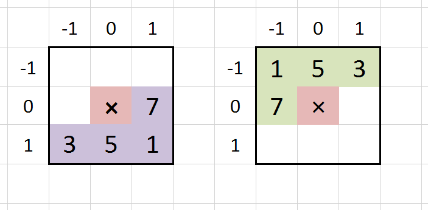

---

    [lang=fs]
    module FloydSteinberg =
        open Value

        let processLayer quantize input =
            let height, width = Matrix.sizeOf input
            let output = Matrix.zeroCreate height width
            let yH = height - 1

            let inline processRow y (cy0: Value[]) =
                // ...

            // let mutable cy = Array.zeroCreate (width + 2)
            // for y = 0 to yH do cy <- processRow y cy
            let cy0 = Array.zeroCreate (width + 2)
            (0, yH) |> Range.fold processRow cy0 |> ignore

            output

---

    [lang=fs]
    module FloydSteinberg =
        open Value

        let processLayer quantize input =
            // ...
            let inline processRow y (cy0: Value[]) =
                let cy1 = Array.zeroCreate (width + 2)
                let xW = width - 1

                let inline calculateValue x c = 
                    let expected = input.[y, x] + cy0.[x + 1] + c
                    let actual = quantize expected
                    output.[y, x] <- actual
                    expected - actual

                let inline diffuseError x error =
                    let error' = error / 16.0
                    let inline diffuseDown x error ratio = 
                        cy1.[x + 1] <- cy1.[x + 1] + error * ratio
                    diffuseDown (x - 1) error' 3.0
                    diffuseDown x error' 5.0
                    diffuseDown (x + 1) error' 1.0
                    error' * 7.0

                let inline processPixel x c = 
                    c |> calculateValue x |> diffuseError x

                // let mutable c = 0.0
                // for x = 0 to xW do c <- processPixel x c
                (0, xW) |> Range.fold processPixel 0.0 |> ignore

                cy1
            // ...

---

The effect?

    [lang=fs]
    #load "init.fsx"
    open FsDither

    let quantize = Value.quantize 2

    "flowers-large.jpg" 
    |> Picture.load
    |> Picture.quickGrayscaleSlides [
        "none", id
        "treshold", Treshold.processLayer quantize
        "random", Random.processLayer 1.0 quantize
        "bayer8", Bayer.processLayer Bayer.bayer8x8 quantize
        "floyd", FloydSteinberg.processLayer quantize
    ]

(**Note**: try 4, 8, 16)

---

Actually we can use dithering on each channel separately.
Let's start with map/reduce for 3-item-tuple:

    [lang=fs]
    module Triplet =
        let inline map f (a, b, c) = (f a, f b, f c)
        let inline reduce f (a, b, c) = a |> f b |> f c

---

    [lang=fs]
    module Picture = 
        let split (picture: Pixel[,]) =
            (Pixel.getR, Pixel.getG, Pixel.getB) 
            |> Triplet.map (fun f -> Matrix.pmap f picture)

        let join ((red: Value[,], green: Value[,], blue: Value[,]) as layers) =
            let width = layers |> Triplet.map Matrix.widthOf |> Triplet.reduce min
            let height = layers |> Triplet.map Matrix.heightOf |> Triplet.reduce min
            let inline combine y x = Pixel(red.[y, x], green.[y, x], blue.[y, x])
            Matrix.pinit height width combine

---

Now we can apply Floyd-Steinberg to 3 channels:

    [lang=fs]
    #load "init.fsx"
    open FsDither

    let image = "flowers-large.jpg" |> Picture.load 
    let quant = Value.quantize 4
    let floyd = FloydSteinberg.processLayer quant

    image
    |> Picture.toGrayscale 
    |> floyd
    |> Picture.fromGrayscale 
    |> Picture.showOne "grayscale4"

    image
    |> Picture.split
    |> Triplet.map floyd
    |> Picture.join
    |> Picture.showOne "color4"

---

Floyd-Steinberg is not parallel algorithm, but at least we can apply it to 3 channels in parallel:

    [lang=fs]
    module Triplet =
        let inline pmap f (a, b, c) =
            match [|a; b; c|] |> Array.Parallel.map f with 
            | [|a; b; c|] -> (a, b, c) 
            | _ -> failwith "Not going to happen"

---

Let's see:

    [lang=fs]
    #load "init.fsx"
    open FsDither

    let image = "flowers-large.jpg" |> Picture.load 
    let quant = Value.quantize 4
    let floyd = FloydSteinberg.processLayer quant

    image
    |> Picture.split
    |> Debug.timeit "map" (Triplet.map floyd)
    |> Picture.join
    |> Picture.showOne "map"

    image
    |> Picture.split
    |> Debug.timeit "pmap" (Triplet.pmap floyd)
    |> Picture.join
    |> Picture.showOne "pmap"

    // map: 67.0074ms
    // pmap: 28.1844ms

***

### Parallel Floyd-Steinberg

> For a number of years it was believed that this technique is inherently sequential and could not be parallelized.

http://bit.ly/1JCyvC2

---

> The Floyd-Steinberg method often gives excellent results, but it has drawbacks. In the first place, it is inherently serial method; the value of B[m, n] depends on all mn of the entries of A. -- **Donald E. Knuth, "Digital Halftones by Dot Diffusion", Stanford University**

http://bit.ly/1z8XBlR

---

It can be partially parallelized because:

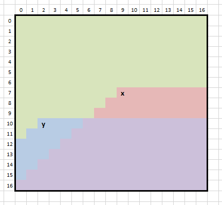

---

Two patches `x` and `y` can be processed in parallel:

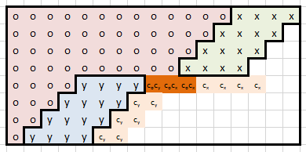

---

And map of all patches looks like this:

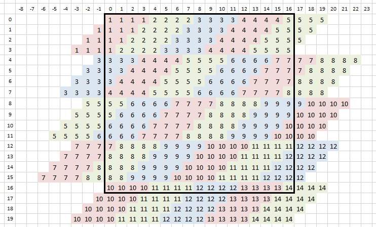

---

The task is:

- Implement patch sequence generation (`seq<seq<Patch>>`)
- Implement Floyd-Steinberg for Patch
- Run it (Seq.iter (Seq.piter processPatch))

---

Challenges:

- More `IndexOutOfRange` checking than sequential
- Error has to be stored and cumulated in output matrix
- Parallelization overhead kills the benefits for small images

---

    [lang=fs]
    module PFloydSteinberg =
        let processLayer quantize input =
            let (height, width) as size = input |> Matrix.sizeOf 
            let output = Matrix.zeroCreate height width

            size
            |> enumeratePatches (128, 128)
            |> Seq.iter (Seq.piter (processPatch quantize input output))

            output

(**Note**: refer to sources in GitHub for details)

---

Let's do some benchamarks:

    [lang=fs]
    #load "init.fsx"
    open FsDither

    let image = "college-huge.jpg" |> Picture.load 
    let quant = Value.quantize 4
    let sfloyd = FloydSteinberg.processLayer quant
    let pfloyd = PFloydSteinberg.processLayer quant

    image
    |> Picture.toGrayscale
    |> Debug.timeit "serial" sfloyd
    |> Picture.fromGrayscale |> Picture.showOne "serial"
    System.GC.Collect(2)

    image
    |> Picture.toGrayscale
    |> Debug.timeit "parallel" pfloyd
    |> Picture.fromGrayscale |> Picture.showOne "parallel"
    System.GC.Collect(2)

    // serial: 822.931ms
    // parallel: 403.778ms

(**Note**: not 4 times faster)

***

### Pint-Floyd-Steinberg

---

How much we can gain by using `int` instead of `float`?

    [lang=fs]
    module PintFloydSteinberg = 
        // integer quantizer
        let quantizerSteps = levels - 1
        let quantizerStepWidth = (0x10000 / quantizerSteps) >>> 1
        let inline quantize v = 
            (((v + quantizerStepWidth) * quantizerSteps) &&& ~~~0xFFFF) / quantizerSteps 
            |> max 0 |> min 0x10000

        // integer diffusor
        let inline diffuseError x error =
            let error4 = error <<< 2
            let inline div16round v = (v + 8) >>> 4
            let inline diffuseDown x error = setcy1 x (error |> div16round)
            diffuseDown (x - 1) (error4 - error)
            diffuseDown x (error4 + error)
            diffuseDown (x + 1) error
            (error4 <<< 1) - error |> div16round

---

Let's see:

    [lang=fs]
    #load "init.fsx"
    open FsDither

    let image = "college-huge.jpg" |> Picture.load 
    let quant = Value.quantize 4
    let pfloyd = PFloydSteinberg.processLayer quant
    let ifloyd = PintFloydSteinberg.processLayer 4

    image
    |> Picture.toGrayscale
    |> Debug.timeit "float" pfloyd
    |> Picture.fromGrayscale |> Picture.showOne "float"

    System.GC.Collect(2)

    image
    |> Picture.toGrayscale
    |> Matrix.pmap PintFloydSteinberg.fromFloat
    |> Debug.timeit "integer" ifloyd
    |> Matrix.pmap PintFloydSteinberg.toFloat
    |> Picture.fromGrayscale |> Picture.showOne "integer"

    System.GC.Collect(2)

    // float: 421.629ms
    // integer: 211.938ms

***

### Questions?

***

# Turn back.

***

# Turn back, now.

***

# Really?

***

### Inherently SOLID

- Single responsibility principle
- Open/closed principle
- Liskov substitution principle
- Interface segregation principle
- Dependency inversion principle

---

#### Single responsibility principle

> a class should have only a single responsibility (i.e. only one potential change in the software's specification should be able to affect the specification of the class)

**Answer**: Function

---

#### Open/closed principle

> should be open for extension, but closed for modification.

**Answer**: Function

---

#### Liskov substitution principle

> objects in a program should be replaceable with instances of their subtypes without altering the correctness of that program.

**Answer**: Composition over inheritance

---

#### Interface segregation principle

> many client-specific interfaces are better than one general-purpose interface.

**Answer**: Function

---

#### Dependency inversion principle

> Depend upon abstractions. Do not depend upon concretions.

**Answer**: Function

***

#### Module extensions

Ever wanted to extend `DateTime`, or `Math`?
You usually end up with `EnumerableEx`, `DateTimeHelpers`, `StringUtils` and `Streams`.

---

    [lang=fs]
    open System.Globalization

    module DateTime =
        let private cultureInfoUS = CultureInfo.GetCultureInfo("en-US")
        let FromUS text = DateTime.Parse(text, cultureInfoUS)

    module Program =
        let someUSDateTime = "7/31/2015"
        let importDateTime = DateTime.FromUS(text)
        let currentDateTime = DateTime.Now // regular DateTime

---

...of course, you can still extend objects as in C#:

    [lang=fs]
    open System

    type DateTime with
        member x.ToUS () = "1/31/2014" // whatever it takes

    DateTime.Now.ToUS() |> printfn "%A"

***

#### Ad-hoc interface implementation

Let's imagine `IFactory<T>`:

    [lang=cs]
    public interface IFactory<T>
    {
        T Create();
    }

and some code which utilizes it:

    [lang=cs]
    public static PrintSomeNumbers(IFactory<double> factory)
    {
        for (var i = 0; i < 100; i++)
        {
            Console.WriteLine(factory.Create());
        }
    }

---

Let's say somewhere in the application we need to call `PrintSomeNumbers` with some random numbers:

    [lang=cs]
    public class RandomDoubleFactory : IFactory<double>
    {
        private Random _generator = new Random();

        public double Create()
        {
            return _generator.NextDouble();
        }
    }

    static void Main(string[] argv)
    {
        PrintSomeNumbers(new RandomDoubleFactory());
    }

---

In F# we can use ad-hoc interface implementation:

    [lang=fs]
    let main argv =
        let generator = Random()
        let adhoc = { new IFactory<double> with member x.Create() = generator.NextDouble() }
        PrintSomeNumbers(adhoc)

Used frequently with `IDisposable`

***
