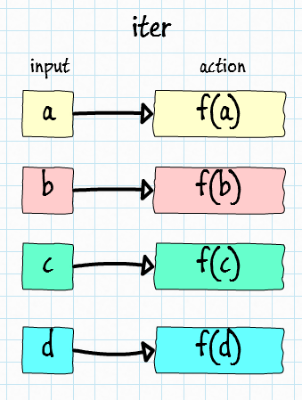
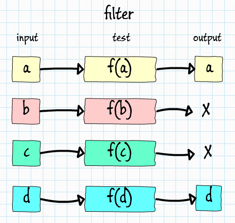

- title : Playing with Bayer, Floyd and Steinberg
- description : F# by example: Playing with Bayer, Floyd and Steinberg
- author : Milosz Krajewski (milosz.krajewski@gmail.com)
- theme : beige
- transition : default

***

# F# by example
## Playing with Bayer, Floyd and Steinberg...

## ...and Knuth

***

### About me

- Milosz Krajewski
- BLOBAs @ Sepura
- first line of code written in ~1984
- C, C++, C#, SQL
- Python, F#

---

- Algorithms
- Data Structures
- Algorithm Complexity
- Graph Theory
- Design Patterns

---

- Parallel
- Distributed
- Reactive
- Functional

***

> All generalizations are false, including this one. -- **Mark Twain**

---

> It is not about what is possible, it is about what is natural. -- **Me**

***

### Agenda

- explain basic concepts about F#
- solve non-trivial problem using F#
- use idiomatic F#
- use non-idiomatic F# when beneficial
- prove Donald Knuth wrong (kind of)

***

Once upon the time we were doing this:

    [lang=cs]
    public List<Person> ParseCsvFile(string fileName)
    {
        var result = new List<Person>();
        var reader = new StreamReader(fileName);
        while (true)
        {
            var line = reader.ReadLine();
            if (line == null)
                break;
            var person = ParseCsvLine(line);
            result.Add(person);
        }
        
        return person;
    }
    
(actually, there was no type inference)

---

But now we do it more like this:

    [lang=cs]
    public static IEnumerable<string> EnumerateLines(this TextReader reader)
    {
        string line;
        while ((line = reader.ReadLine()) != null)
            yield return line;
    }
    
    public IEnumerable<Person> ParseCsvFile(string fileName)
    {
        return 
            new StreamReader(fileName)
            .EnumerateLines()
            .Select(l => ParseCsvLine(l));
    }

---

Just because it is much easier to make it parallel:

    [lang=cs]
    public IEnumerable<Person> ParseCsvFile(string fileName)
    {
        return 
            new StreamReader(fileName)
            .EnumerateLines()
            .AsParallel()
            .Select(l => ParseCsvLine(l));
    }

---

or even more parallel:

    [lang=cs]
    public IEnumerable<Person> ParseCsvFiles(IEnumerable<string> fileNames)
    {
        return 
            fileNames
            .AsParallel()
            .SelectMany(fn => ParseCsvFile(fn));
    }
    
***

If you like those features in C#:

- Generics
- Nullables
- Iterators (`yield`)
- Implicit types and type inference (`var` and `X<T>`)
- Lambda functions
- Asynchronous (`async` and `await`)
- Linq / extension methods

F# is for you.

***

### F# is

- Low ceremony, low noise
- Visually honest
- Strongly typed with type inference and automatic generalization
- Expression orientated
- Pattern matching
- Functional
- Immutable by default
- Inherently SOLID (but I will skip this one)

***

#### Low ceremony, low noise

`PersonDTO` in C#

    [lang=cs]
    public class PersonDTO
    {
        private readonly Guid _id = Guid.NewGuid();
        private readonly string _name;
        private readonly int _age;
        
        public Guid Id { get { return _id; } }
        public string Name { get { return _name; } }
        public int Age { get { return _age; } }
        
        public PersonDTO(string name, int age)
        {
            if (ReferenceEquals(name, null)) 
                throw new ArgumentNullException("name");
            _name = name;
            _age = age;
        }
        
        public override ToString()
        {
            return string.Format("PersonDTO(Name: \"{0}\", Age: {1})", _name, _age);
        }
    }

(...not over yet...)

---

    [lang=cs]
    public class PersonDTO
    {
        public override Equal(object obj)
        {
            if (ReferenceEquals(obj, this)) 
                return true;
            var other = obj as PersonDTO;
            if (ReferenceEquals(other, null)) 
                return false;
            return Name == other.Name && Age == other.Age;
        }
        
        public override int GetHashCode()
        {
            return Name.GetHashCode() * 7 + Age.GetHashCode();
        }
    }

---

while in F# it would be:

    [lang=fs]
    open System

    type PersonDTO(name, age) =
        let id = Guid.NewGuid()
        member x.Id = id
        member x.Name = name
        member x.Age = age
        override x.ToString() = sprintf "Person(Name: \"%s\", Age: %d)" name age

---

***

#### Visual honesty

---

C# is generally left-to-right and top-down, but has islands of right-to-left'isms and bottom-up'isms:
    
    [lang=cs]
    SendEmail(
        GenerateEmailFromTemplate(
            "YouHaveBeenSelectedTemplate",
                GetPersonsEmailAddress( 
                    FindPersonById(id))));
                    
---

F# helps to sort this out using `|>` operator:

    [lang=fs]
    id 
    |> findPersonById
    |> getPersonsEmailAddress
    |> generateEmailFromTemplate "YouHaveBeenSelectedTemplate"
    |> sendEmail

although, it is binary identical to:

    [lang=fs]
    sendEmail (
        generateEmailFromTemplate "YouHaveBeenSelectedTemplate" (
            getPersonsEmailAddress (
                findPersonById id)))

---

What would this code print?

    [lang=fs]
    let mutable (x, y) = 0, 1
    for i = 1 to 8 do
       x <- x + 1
       y <- y * 2
    printfn "%d,%d" x y

---

And this one?

    [lang=cs]
    int x = 0, y = 1;
    for (var i = 1; i <= 8; ++i)
       x = x + 1;
       y = y * 2;
    Console.WriteLine("{0},{1}", x, y);

***

#### Strongly typed with type inference (and automatic generalization)

    [lang=fs]
    let func1 a b f = a, b
    let func2 a b f = f a, b
    let func3 a b f = f a, f b
    let func4 a b f = f (a + " ?"), f (b + " !")
    let func5 a b f = f (a + " ?") + 1, f (b + " !")

---

It's like `var` but everywhere:

    [lang=fs]
    open System

    /// retries given action
    /// returns its result or throws exception
    /// after `countLimit` failures or when `timeLimit` expires
    let retry countLimit timeLimit func arg =
        let timeLimit = DateTime.Now.Add(TimeSpan.FromSeconds(timeLimit))
        let rec retry count =
            match count, DateTime.Now with
            | c, t when (c > 0) && (c > countLimit || t > timeLimit) ->
                failwith "Operation failed"
            | c, _ ->
                try func arg with | _ -> retry (c + 1)
        retry 0

***

#### Expression orientated

in C# `switch` is a statement not an expression, it doesn't have result, it just does things:

    [lang=cs]
    string text; // know your type
    switch (digit)
    {
        case 0: text = "zero"; // do-assign
        case 1: text = "one";
        // ...
        case 9: text = "nine";
    }

---

Sometime you just wish for:

    [lang=cs]
    var text = switch (digit) {
        case 0: "zero"; // evaluate-and-return
        case 1: "one";
        // ...
        case 9: "nine";
    };

---

In F# `match` is an expression

    [lang=fs]
    let text =
        match digit with
        | 0 -> "zero"
        | 1 -> "one"
        // ...
        | 9 -> "nine"

---

...as well as `try`/`catch`:

    [lang=fs]
    let text = Console.ReadLine()
    let value = try Int32.Parse(text) with | _ -> 0
    printfn "%d" value

---

in C# it get's messy when variable is of some complex type:

    [lang=cs]
    IEnumerable<IGrouping<int, Tuple<string, IEnumerable<double>>> result;

    try
    {
        result = SomeFunctionReturningComplexType();
    }
    catch (Exception e)
    {
        result = AlternativeAccessToResult();
    }

    DoSomethingWith(result);

---

`var` is not an option as it would limit the scope:

    [lang=cs]
    try
    {
        var result = SomeFunctionReturningComplexType();
    }
    catch (Exception e)
    {
        var result = AlternativeAccessToResult();
        // ???
    }

    // "result" is not available here...

---

Generators (`IEnumerable`) are also expressions (not functions):

    [lang=fs]
    let powers = seq { for i = 0 to 31 do yield 1u <<< i }
    for p in powers do
        printfn "%d" p

***

#### Pattern matching

`match` expression

    [lang=fs]
    let func4 array =
        match array with
        | [| x; 0; 0 |] -> printfn "Yup, %d and two zeroes" x
        | [| _; 2; _ |] -> printfn "2 in the middle"
        | [| _; _; _ |] -> printfn "3 random elements"
        | _ -> printfn "I wanted 3 elements, not %d" array.Length

    func4 [| 3; 0; 0 |] // Yup, 3 and two zeroes
    func4 [| 4; 2; 2 |] // 2 in the middle
    func4 [| 6; 1; 7 |] // 3 random elements
    func4 [| 1 |] // I wanted 3 elements, not 1

---

The `EnumerateLines` method we used before:

    [lang=cs]
    public static IEnumerable<string> EnumerateLines(this TextReader reader)
    {
        string line;
        while ((line = reader.ReadLine()) != null)
            yield return line;
    }

had two sub-optimal solutions:

- up-front declaration of `line`
- naughty assigment in the middle of condition

---

Just because of `match` syntax we don't need to do any of those:

    [lang=fs]
    let rec enumerateLines (reader: TextReader) =
        seq {
            match reader.ReadLine() with
            | null -> ()
            | line -> yield line; yield! enumerateLines reader
        }

(with type extender, if you like)

    [lang=fs]
    type TextReader with member reader.EnumerateLines() = reader |> enumerateLines

---

`tuple` unpacking

    [lang=fs]
    let func1 p =
        let x, y = p
        printfn "as tuple: %A, as x and y: %A, %A" p x y

    let func2 ((x, y) as p) =
        printfn "as tuple: %A, as x and y: %A, %A" p x y

    let func3 ((x, _) as p) =
        let (_, y) = p
        printfn "as tuple: %A, as x and y: %A, %A" p x y

     // as tuple: (1234, 3455), as x and y: 1234, 3455
    func1 (1234, 3455)
    func2 (1234, 3455)
    func3 (1234, 3455)

---

Bait-and-switch / is-as:

    [lang=fs]
    open System.Text

    let func5 (subject: obj) =
        match subject with
        | :? StringBuilder as sb -> sb.Append(" was a StringBuilder").ToString()
        | :? string as s -> s + " is a string"
        | _ -> invalidArg "subject" "No idea what to do"

    // StringBuilder was a StringBuilder
    func5 (StringBuilder().Append("StringBuilder")) |> printfn "%s"

    // string is a string
    func5 ("string") |> printfn "%s"

---

C# alternative (`is` and `as`)

    [lang=cs]
    static string Func5(object subject)
    {
        if (subject is StringBuilder)
        {
            var sb = subject as StringBuilder;
            return sb.Append(" was a StringBuilder").ToString();
        }
        else if (subject is string)
        {
            var s = subject as string;
            return s + " is a string";
        }
        else
        {
            throw new ArgumentException("No idea what to do", "subject");
        }
    }
    
**Problem**: double cast

---

C# alternative (`as` and `null`)

    [lang=cs]
    static string Func5(object subject)
    {
        var sb = subject as StringBuilder;
        var s = subject is string;

        if (sb != null)
        {
            return sb.Append(" was a StringBuilder").ToString();
        }
        else if (s != null)
        {
            return s + " is a string";
        }
        else
        {
            throw new ArgumentException("No idea what to do", "subject");
        }
    }
    
**Problem**: wrong scope (too wide) and premature evaluation

---

C# alternative (`as` and `null`)

    [lang=cs]
    static string Func5(object subject)
    {
        var sb = subject as StringBuilder;

        if (sb != null)
        {
            return sb.Append(" was a StringBuilder").ToString();
        }
        else
        {
            var s = subject is string;
            
            if (s != null)
            {
                return s + " is a string";
            }
            else
            {
                throw new ArgumentException("No idea what to do", "subject");
            }
        }
    }
    
**Problem**: else induced pyramid of doom

***

#### Functional

The answer to lot of questions is: **function**

---

All functions have one argument and one result.

---

You would think that you have:

    [lang=cs]
    Action action;
    Func<T> factory;
    Func<T, U> converter;
    Func<T, U, V> combinator;

while in fact there is only one type:

    [lang=cs]
    Func<T, U> func;

or:
    
    [lang=fs]
    func: 'a -> 'b

---

C#

    [lang=cs]
    Action action; // Func<void, void>

F#

    [lang=fs]
    action: unit -> unit

---

C#

    [lang=cs]
    Action<string> action; // Func<string, void>

F#

    [lang=fs]
    action: string -> unit

---

C#

    [lang=cs]
    Func<string> func; // Func<void, string>

F#

    [lang=fs]
    func: unit -> string

---

C#

    [lang=cs]
    Func<double, string> func;

F#

    [lang=fs]
    func: float -> string

---

C#

    [lang=cs]
    Func<double, int, byte[], string> func;

F#

    [lang=fs]
    func: (float * int * byte[]) -> string

---

F#

    [lang=fs]
    func: float -> int -> byte[] -> string

is actually:

    [lang=fs]
    func: float -> (int -> (byte[] -> string))

you can model it in C# but you rarely see it:

    [lang=cs]
    Func<float, Func<int, Func<byte[], string>>> func;

---

Currying / partial application

    [lang=fs]
    let sendEmailsToAll (personLoader: int -> Person) =
        for id in getAllPersonIds () do
            let person = personLoader id
            sendEmailTo person

    let loadPerson (connection: SqlConnection) (id: int) =
        // ... do stuff ...

    sendEmailsToAll (loadPerson connection)

***

#### Immutable by default

How I can get anything done without mutability?

***

Once upon the time...

    [lang=basic]
    10 PRINT "THIS IS PROGRAM IN BASIC"
    20 LET P = 3.1415927
    30 LET E = 2.7172
    50 LET X = E * P
    60 IF X > 6 THEN PRINT "X is greater than 6"
    70 FOR I = 1 TO 100 DO PRINT "I is " + I
    80 LET X = X + 1
    ...

***

Let's consider a program to calculate a sum of given numbers:

    [lang=cs]
    public static double Sum(double[] values)
    {
        var sumSoFar = 0.0;
        for (var index = 0; index < values.Length; index++)
            sumSoFar += values[index];
        return sumSoFar;
    }

    public static void Main()
    {
        Console.WriteLine("{0}", Sum(new[] { 1.0, 2.0, 3.0, 4.0 }));
    }

***

In F# you don't mutate result:

    [lang=fs]
    let sum values =
       let rec partial sumSoFar list =
           match list with
           | [] -> sumSoFar
           | head :: tail -> partial (head + sumSoFar) tail
       partial 0.0 values

    printfn "%g" (sum [ 1.0; 2.0; 3.0; 4.0 ])

you produce new result and pass it forward

***

### Idiomatic?

> **idiomatic**: using, containing, or denoting expressions that are natural to a native speaker.

***

### Idiomatic F#?

- Separation of data and behaviour
- Functions all the way down
- No abstraction is too small
- Map/reduce

***

### map

    [lang=fs]
    X.map: (f: 'T -> 'U) -> (x: X<'T>) -> X<'U>

---

in C# known as `Select`, for example:

    [lang=fs]
    ["image1.jpg"; "image2.jpg"]
    |> Seq.map Image.FromFile

is equivalent to:

    [lang=cs]
    new { "image1.jpg", "image2.jpg" }
        .Select(fn => Image.FromFile(fn))

***

### reduce

    [lang=fs]
    X.reduce (f: 'T -> 'T -> 'T) -> (x: X<'T>) -> 'T

---

#### sum

    [lang=fs]
    values |> Seq.reduce (+)

---

#### factorial n

    [lang=fs]
    // { 2..n } = seq { for i = 2 to n do yield i }
    { 2..n } |> Seq.reduce (*)

---

#### min

    [lang=fs]
    values |> Seq.reduce (fun a b -> if a <= b then a else b)

---

#### count

    [lang=fs]
    values |> Seq.map (fun _ -> 1) |> Seq.reduce (+)

---

#### first

    [lang=fs]
    values |> Seq.reduce (fun a b -> a)

---

#### last

    [lang=fs]
    values |> Seq.reduce (fun a b -> b)

***

### fold

    [lang=fs]
    X.fold (f: 'S -> 'T -> 'S) -> (s: 'S) -> (x: X<'T>) -> 'S

---

    [lang=fs]
    let reduce =
        [1; 2; 3; 4; 5]
        |> Seq.reduce (fun a b -> a + b)

    let fold1 =
        [1; 2; 3; 4; 5]
        |> Seq.fold (fun a b -> a + b) 0

    let fold2 =
        [1; 2; 3; 4; 5]
        |> Seq.fold (fun s n -> s + string n) ""

    // reduce: 15, fold1: 15, fold2: "12345"
    printfn "reduce: %A, fold1: %A, fold2: %A" reduce fold1 fold2

***

### iter

    [lang=fs]
    X.iter (f: 'T -> unit) -> (x: X<'T>) -> unit
    

---

    [lang=fs]
    let countDown () = 
        { 10..-1..0 }
        |> Seq.iter (printfn "%d")
        
    // 10... 9... 8... 1... 0
    countDown ()

***

### filter

    [lang=fs]
    X.filter (f: 'T -> bool) -> (x: X<'T>) -> X<'T>
    

---

    [lang=fs]
    let allNumbers = [ 1..10 ]
    let evenNumbers = 
        allNumbers 
        |> List.filter (fun n -> n % 2 = 0)

    // all: [1; 2; 3; 4; 5; 6; 7; 8; 9; 10], even: [2; 4; 6; 8; 10]
    printfn "all: %A, even: %A" allNumbers evenNumbers

***

### scan

    [lang=fs]
    X.scan (f: 'S -> 'T -> 'S) -> (s: 'S) -> (x: X<'T>) -> X<'S>

---

Like `fold` as it has state, but also yields state on every item:

    [lang=fs]
    let fold =
        [1; 2; 3; 4; 5]
        |> List.fold (fun s n -> s + string n) ""

    let scan =
        [1; 2; 3; 4; 5]
        |> List.scan (fun s n -> s + string n) ""

    // fold: "12345", scan: [""; "1"; "12"; "123"; "1234"; "12345"]
    printfn "fold: %A, scan: %A" fold scan

(btw, `map` is-a `scan`)

***

### Your first zip/fold/scan

***

### unfold

    [lang=fs]
    X.unfold (f: 'S -> ('T * 'S) option) -> 'S -> X<'T>

---

    [lang=fs]
    let countDown =
        10
        |> Seq.unfold (fun s -> if s < 0 then None else Some (string s, s - 1))
        |> Seq.toList

    // unfold: ["10"; "9"; "8"; "7"; "6"; "5"; "4"; "3"; "2"; "1"; "0"]
    printfn "unfold: %A" countDown

***

### Everything* is unfold/filter/map/fold

    [lang=fs]
    let csvToXml fileName =
        fileName
        |> openStream
        |> Seq.unfold readLine
        |> Seq.map tryParsePerson
        |> Seq.filter isValidPerson
        |> Seq.fold addToXml (XmlDocument())

*actually, everything is `.SelectMany(...)`

***

### Dithering

> **Dither**: is an intentionally applied form of noise used to randomize quantization error, preventing large-scale patterns such as color banding in images.

(from [Wikipedia](http://en.wikipedia.org/wiki/Dither))

---

#### Original

---

#### Treshold

---

#### Random

---

#### Bayer

---

#### Floyd-Steinberg

***

    [lang=fs]
    open System.IO
    open System.Diagnostics

    [<AutoOpen>]
    module Tools =
        #if INTERACTIVE
        let root = __SOURCE_DIRECTORY__
        #else
        let root = "."
        #endif

        let timeit name func arg =
            let timer = Stopwatch.StartNew()
            let result = func arg
            timer.Stop()
            printfn "%s: %f" name timer.Elapsed.TotalMilliseconds
            result

        let resolvePath path = Path.Combine(root, path)

***

    [lang=fs]
    module UI =
        open System.Drawing
        open System.Threading
        open System.Windows.Forms

        type ViewerForm() as form =
            inherit Form(TopMost = true)

            let viewer = 
                new PictureBox(
                    Dock = DockStyle.Fill, 
                    SizeMode = PictureBoxSizeMode.Zoom)

            do form.Controls.Add(viewer)

            member form.LoadImage (title, image) = 
                form.Text <- title
                viewer.Image <- image
                form.AdjustSize image.Size

            member form.NextImage =
                form.KeyPress
                |> Event.filter (fun e -> e.KeyChar = ' ')
                |> Event.map (fun _ -> form)

---

    [lang=fs]
    module UI =
        type ViewerForm() as form =
            member private form.AdjustSize clientSize =
                let screenRect = Screen.FromControl(form).WorkingArea
                let formMargin = 
                    Size(form.Width - form.ClientSize.Width, form.Height - form.ClientSize.Height)
                let maximumClientSize = 
                    Size(screenRect.Width - formMargin.Width, screenRect.Height - formMargin.Height)

                let ratioX = float maximumClientSize.Width / float clientSize.Width
                let ratioY = float maximumClientSize.Height / float clientSize.Height
                let ratio = min ratioX ratioY
                let clientX = float clientSize.Width * ratio |> round |> int
                let clientY = float clientSize.Height * ratio |> round |> int
                let originX = (screenRect.Left + screenRect.Width - clientX - formMargin.Width) / 2
                let originY = (screenRect.Top + screenRect.Height - clientY - formMargin.Height) / 2

                form.SetBounds(originX, originY, clientX + formMargin.Width, clientY + formMargin.Height)

---

    [lang=fs]
    module UI =
        let private show (setup: ViewerForm -> unit) =
            let action () = 
                let form = new ViewerForm()
                setup form
                Application.Run(form)
            Thread(action, IsBackground = true).Start()

        let showOne title image =
            show (fun f ->
                f.NextImage |> Event.add (fun _ -> f.Close())
                f.LoadImage(title, image)
            )

        let showMany (images: (string * #Image) seq) =
            let images = images.GetEnumerator()
            show (fun f ->
                let nextImage () = 
                    match images.MoveNext() with
                    | true -> images.Current |> f.LoadImage
                    | _ -> f.Close()
                f.NextImage |> Event.add (fun _ -> nextImage ())
                nextImage ()
            )

---

I didn't like 3-line `action ()` in `show (...)`, so from:

    [lang=fs]
    let private show (setup: ViewerForm -> unit) =
        let action () = 
            let form = new ViewerForm()
            setup form
            Application.Run(form)
        Thread(action, IsBackground = true).Start()

it became:

    [lang=fs]
    let private show (setup: ViewerForm -> unit) =
        let inline apply func arg = func arg; arg
        let action () = Application.Run(new ViewerForm() |> apply setup)
        Thread(action, IsBackground = true).Start()

(**NOTE:** `apply`, `Array.Sort(...)` and `.Do(...)`)

---

actually, for interactive session:

    [lang=fs]
    #if INTERACTIVE
    let private show (setup: ViewerForm -> unit) =
        let inline apply func arg = func arg; arg
        (new ViewerForm() |> apply setup).Show()
    #else
    // ...
    #endif

---

    [lang=fs]
    open System.Drawing
    open System.Drawing.Imaging
    open System.Runtime.InteropServices

    module Bitmap =
        let bitmapFormat = PixelFormat.Format32bppRgb

        let private enforceFormat (image: Image) =
            match image with
            | :? Bitmap as bitmap when bitmap.PixelFormat = bitmapFormat ->
                bitmap
            | _ ->
                let width, height = image.Width, image.Height
                let bitmap = new Bitmap(width, height, bitmapFormat)
                use graphics = Graphics.FromImage(bitmap)
                graphics.DrawImage(image, 0, 0, width, height)
                bitmap

        let load (fileName: string) = 
            let fileName = Tools.resolvePath fileName
            fileName |> Image.FromFile |> enforceFormat
            
(**NOTE:** bait-and-switch and shadowing)

---

at this point we can show some pictures:

    [lang=fs]
    #load "load-project.fsx"
    open FsDither

    "lena.jpg" |> Bitmap.load |> UI.showOne "lena"
    ["lena.jpg"; "david.jpg"] |> Seq.iter (fun fn -> fn |> Bitmap.load |> UI.showOne fn)
    ["lena.jpg"; "david.jpg"] |> Seq.map (fun fn -> (fn, fn |> Bitmap.load)) |> UI.ahowMany

---

    [lang=fs]
    module Bitmap =
        let lockBits (lockMode: ImageLockMode) (func: BitmapData -> 'a) (bitmap: Bitmap) =
            let width, height = bitmap.Width, bitmap.Height
            let rect = Rectangle(0, 0, width, height)
            let data = bitmap.LockBits(rect, lockMode, bitmapFormat)
            try
                func data
            finally
                bitmap.UnlockBits(data)

        let inline private physicalRowAddress line (data: BitmapData) = 
            data.Scan0 + nativeint (data.Stride * line)

        let getPhysicalPixels (data: BitmapData) row =
            assert (data.PixelFormat = bitmapFormat)
            let width = data.Width
            let buffer = Array.zeroCreate<int32> width
            let pointer = data |> physicalRowAddress row
            Marshal.Copy(pointer, buffer, 0, buffer.Length)
            buffer

        let setPhysicalPixels (data: BitmapData) row (vector: int32[]) =
            assert (data.PixelFormat = bitmapFormat)
            assert (data.Width = vector.Length)
            let pointer = data |> physicalRowAddress row
            Marshal.Copy(vector, 0, pointer, vector.Length)

***

### Let's get started...

***

    [lang=fs]
    module Value =
        type Value = float

        let inline fromByte v = (v &&& 0xFF |> float) / 255.0
        let inline toByte v = (v |> min 1.0 |> max 0.0) * 255.0 |> round |> int
        
---

    [lang=fs]
    module Pixel =
        open Value

        [<Struct>]
        type Pixel = 
            val r: Value
            val g: Value
            val b: Value
            new(r, g, b) = { r = r; g = g; b = b }

        let inline fromInt32 physical =
            let inline toValue o v = v >>> o |> Value.fromByte
            Pixel(toValue 16 physical, toValue 8 physical, toValue 0 physical)

        let inline toInt32 (logical: Pixel) =
            let inline toByte o v = v |> Value.toByte <<< o
            (toByte 16 logical.r) ||| (toByte 8 logical.g) ||| (toByte 0 logical.b)

        let inline fromL (l: Value) = Pixel(l, l, l)

        let inline getR (pixel: Pixel) = pixel.r
        let inline getG (pixel: Pixel) = pixel.g
        let inline getB (pixel: Pixel) = pixel.b
        let inline getL (pixel: Pixel) = 0.2126*pixel.r + 0.7152*pixel.g + 0.0722*pixel.b

---
    
Let's add parallel-iter (`piter`) to `Seq` module...

    [lang=fs]
    module Seq =
        let inline piter func (s: 'a seq) = 
            Parallel.ForEach(s, Action<'a>(func)) |> ignore
            
---

...and define a `Range` module for pseudo-sequence `{lo..hi}`

    [lang=fs]
    module Range =
        let inline iter func (lo, hi) = 
            // { lo..hi } |> Seq.iter func
            for i = lo to hi do func i

        let inline piter func (lo, hi) =
            // { lo..hi } |> Seq.piter func
            Parallel.For(lo, hi + 1, Action<int>(func)) |> ignore

---

Technically `Picture` is just `Pixel[,]`:

    [lang=fs]
    open System.Drawing
    open System.Drawing.Imaging

    module Picture = 
        open Value
        open Pixel

        let fromBitmap (bitmap: Bitmap) =
            let width, height = bitmap.Width, bitmap.Height
            let matrix = Matrix.zeroCreate height width

            let inline cloneRow data row = 
                Bitmap.getPhysicalPixels data row
                |> Array.map Pixel.fromInt32
                |> Matrix.applyRow matrix row

            bitmap |> Bitmap.lockBits ImageLockMode.ReadOnly (fun data ->
                (0, height - 1) |> Range.piter (cloneRow data))
            matrix

        let load fileName = 
            fileName |> Bitmap.load |> fromBitmap

---

    [lang=fs]
    module Picture = 
        let toBitmap matrix =
            let height, width = matrix |> Matrix.sizeOf
            let bitmap = new Bitmap(width, height, Bitmap.bitmapFormat)

            let inline cloneRow data row = 
                Matrix.extractRow matrix row
                |> Array.map Pixel.toInt32
                |> Bitmap.setPhysicalPixels data row

            bitmap |> Bitmap.lockBits ImageLockMode.WriteOnly (fun data ->
                (0, height - 1) |> ISeq.piter (cloneRow data))
            bitmap

        let showOne title picture = 
            picture |> toBitmap |> UI.showOne title

        let showMany pictures =
            pictures |> Seq.map (fun (t, p) -> t, p |> toBitmap) |> UI.showMany

***

# Turn back.

***

# Turn back, now.

***

# Really?

***

#### Module extensions

Ever wanted to extend `DateTime`, or `Math`?
You usually end up with `EnumerableEx`, `DateTimeHelpers`, `StringUtils` and `Streams`.

---

    [lang=fs]
    open System.Globalization

    module DateTime =
        let private cultureInfoUS = CultureInfo.GetCultureInfo("en-US")
        let FromUS text = DateTime.Parse(text, cultureInfoUS)

    module Program =
        let someUSDateTime = "7/31/2015"
        let importDateTime = DateTime.FromUS(text)
        let currentDateTime = DateTime.Now // regular DateTime

---

...of course, you can still extend objects as in C#:

    [lang=fs]
    open System

    type DateTime with
        member x.ToUS () = "1/31/2014" // whatever it takes

    DateTime.Now.ToUS() |> printfn "%A"

***

#### Ad-hoc interface implementation

Let's imagine `IFactory<T>`:

    [lang=cs]
    public interface IFactory<T>
    {
        T Create();
    }

and some code which utilizes it:

    [lang=cs]
    public static PrintSomeNumbers(IFactory<double> factory)
    {
        for (var i = 0; i < 100; i++)
        {
            Console.WriteLine(factory.Create());
        }
    }

---

Let's say somewhere in the application we need to call `PrintSomeNumbers` with some random numbers:

    [lang=cs]
    public class RandomDoubleFactory : IFactory<double>
    {
        private Random _generator = new Random();

        public double Create()
        {
            return _generator.NextDouble();
        }
    }

    static void Main(string[] argv)
    {
        PrintSomeNumbers(new RandomDoubleFactory());
    }

---

In F# we can use ad-hoc interface implementation:

    [lang=fs]
    let main argv =
        let generator = Random()
        let adhoc = { new IFactory<double> with member x.Create() = generator.NextDouble() }
        PrintSomeNumbers(adhoc)

Used frequently with `IDisposable`

***

### Very SOLID

- Single responsibility principle
- Open/closed principle
- Liskov substitution principle
- Interface segregation principle
- Dependency inversion principle

---

#### Single responsibility principle

> a class should have only a single responsibility (i.e. only one potential change in the software's specification should be able to affect the specification of the class)

**Answer**: Function

---

#### Open/closed principle

> should be open for extension, but closed for modification.

**Answer**: Function

---

#### Liskov substitution principle

> objects in a program should be replaceable with instances of their subtypes without altering the correctness of that program.

**Answer**: Composition over inheritance

---

#### Interface segregation principle

> many client-specific interfaces are better than one general-purpose interface.

**Answer**: Function

---

#### Dependency inversion principle

> Depend upon abstractions. Do not depend upon concretions.

**Answer**: Function

***

Kevlin Henney - Seven Ineffective Coding Habits of Many Programmers
https://vimeo.com/97329157

***

**Bayes' Rule in LaTeX**

$ \Pr(A|B)=\frac{\Pr(B|A)\Pr(A)}{\Pr(B|A)\Pr(A)+\Pr(B|\neg A)\Pr(\neg A)} $

***
